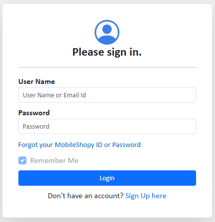
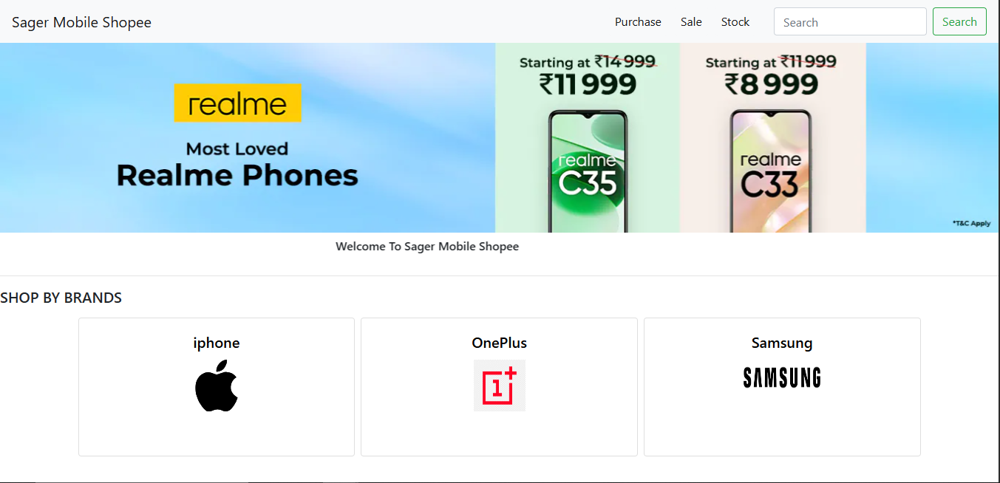
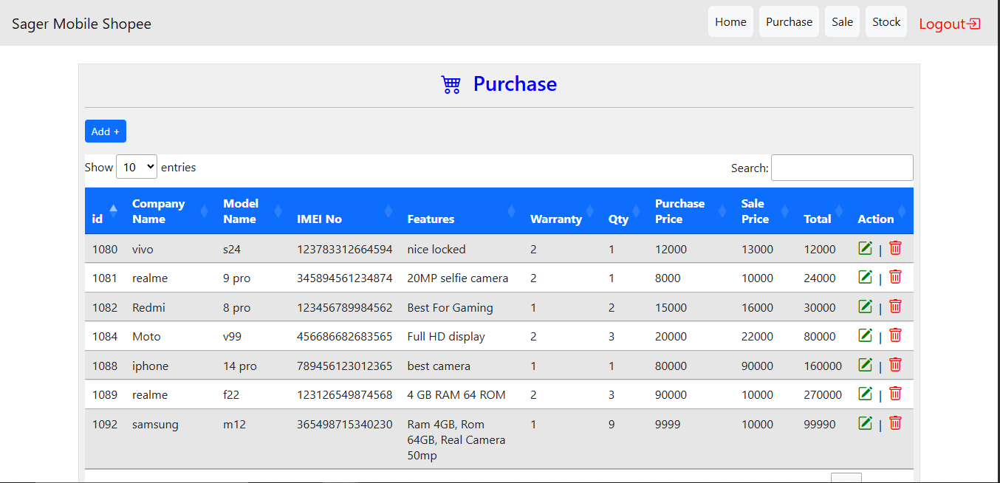
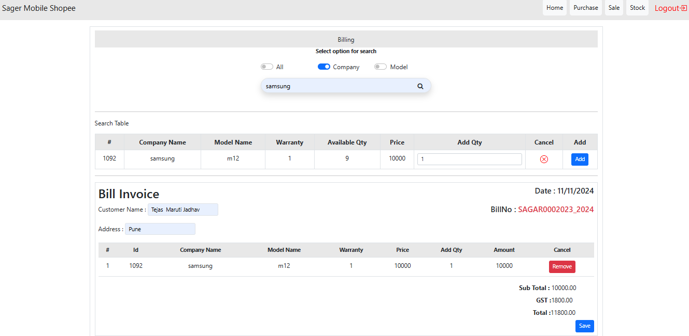
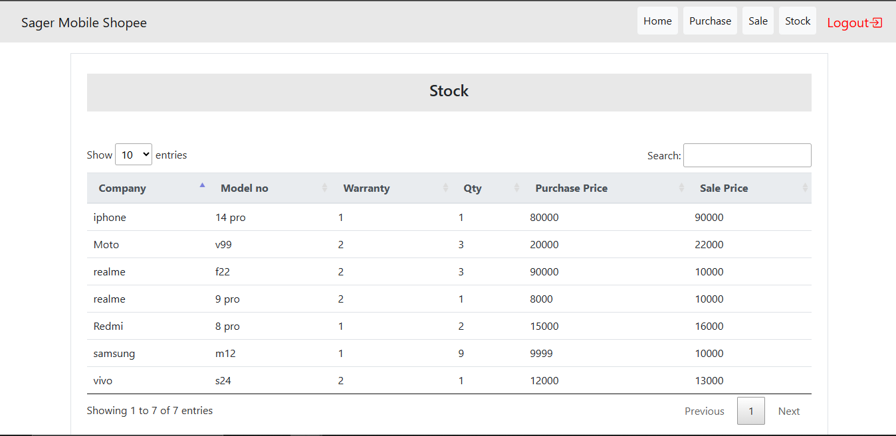

# Techcentre - Mobile Shop Management System

**Techcentre** is a mobile shop management system built using **ASP.NET MVC** with a SQL Server backend. This project is designed to streamline the management of a mobile store by providing a range of functionalities, including:

- **Mobile Data Management**: Add, update, delete, and retrieve details of mobile products.
- **Sales Reporting**: Generate detailed reports for sales transactions.
- **Bill Generation**: Create and print bills for customer purchases.
- **Efficient Operations**: Simplifies daily operations like maintaining inventory, managing sales, and customer interactions.

This project is ideal for small to medium-sized mobile shops to manage product inventories, track sales, and generate bills efficiently.

---

## Features

- **Mobile Management**: Easily manage mobile products, including adding, editing, deleting, and retrieving details.
- **Sales Reports**: Generate reports that provide insights into sales trends and performance.
- **Customer Management**: Manage customer details and interactions to improve service.
- **Inventory Management**: Keep track of available mobile products and stock levels.
- **Sales Transactions**: Process and record sales transactions, with the ability to view transaction histories.
- **Bill Generation**: Generate bills for customer purchases and store bill details for future reference.

---

## Technologies Used

- **ASP.NET MVC**: The web application framework for building dynamic web pages.
- **SQL Server**: The backend database used to store product, customer, and sales information.
- **ADO.NET**: For handling database interactions and executing SQL queries directly.
- **Bootstrap**: For responsive front-end design.

---

## Screenshots

## Screenshots

### 2. Login Screen


### 1. Dashboard


### 3. Mobile Product Update


### 4. Sale Screen


### 5. Stock Management


---

## Installation

### Prerequisites

- **Visual Studio** (recommended version: 2022 or later)
- **SQL Server** (for the database)
- **.NET Framework** (version 4.8 or later)

### Steps to Set Up Locally

1. **Clone the repository:**

   ```bash
   git clone https://github.com/Tejas-Jadhav2003/Techcenter-Project-Using-Asp.Net-MVC.git
2. **Open the project in Visual Studio.**
3. **Set up the database:**
   
- **Create a new SQL Server database.**
- **Restore the database using the MobileShopy.bak file.**
- **Update the connectionString in the Web.config file to match your SQL Server configuration.**
4. **Run the project:**

- **Build and run the solution in Visual Studio.**

---

## Contact

- **Project Owner**: Tejas Jadhav
- **LinkedIn**: [Tejas Jadhav](https://www.linkedin.com/in/tejas-jadhav-aa11a4252/)
- **GitHub**: [Tejas-Jadhav2003](https://github.com/Tejas-Jadhav2003)
